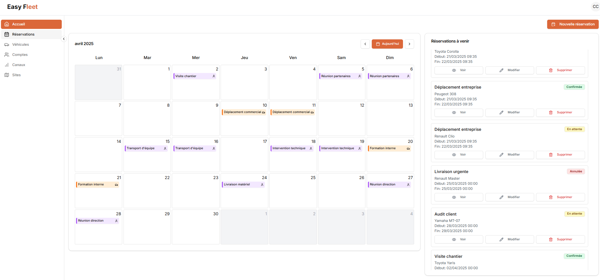

## Easy Fleet

Une solution complète pour la gestion de flotte automobile pour les entreprises de toutes tailles.

## Contexte

L'application Easy Fleet a été développée pour répondre aux besoins de gestion de flotte automobile des entreprises. Elle permet de suivre l'utilisation des véhicules, de gérer les entretiens et de planifier les trajets.

## Fonctionnalités

- Gestion des utilisateurs : création, modification et suppression de comptes utilisateurs
- Gestion des véhicules : ajout, modification, suppression de véhicules
- Gestion des réservations : réservation de véhicules pour des trajets spécifiques
- Statistiques : génération de rapports sur l'utilisation des véhicules
- Authentification : système de connexion sécurisé pour les utilisateurs
- Interface utilisateur : tableau de bord intuitif pour une navigation facile
- API REST : communication entre le frontend et le backend via une API REST
- Responsive : application accessible sur tous les appareils (ordinateurs, tablettes, smartphones)
- Multilingue : prise en charge de plusieurs langues pour une utilisation internationale
- Thème sombre : option pour activer le mode sombre pour une meilleure expérience utilisateur
- Notifications : alertes pour les entretiens à venir et les réservations

## Technologies utilisées

- **Frontend** : NextJS pour une interface utilisateur réactive et dynamique
- **Librairie de composants** : Tailwind CSS pour un design moderne et personnalisable, Shadcn pour des composants réutilisables
- **Backend** : NestJS pour une architecture modulaire et évolutive
- **Base de données** : MySQL pour le stockage des données
- **Conteneurisation** : Docker pour faciliter le déploiement et la gestion des dépendances
- **Gestion de versions** : Git pour le suivi des modifications et la collaboration
- **Tests** : Jest pour les tests unitaires et d'intégration
- **CI/CD** : Gitlab CI pour l'intégration continue et le déploiement continu
- **Hébergement** : Microsfot Azure pour l'hébergement de l'application et la gestion des ressources
- **Sécurité** : Auth.js pour la gestion de l'authentification et des autorisations
- **Documentation** : Swagger pour la documentation de l'API

## Visuel

